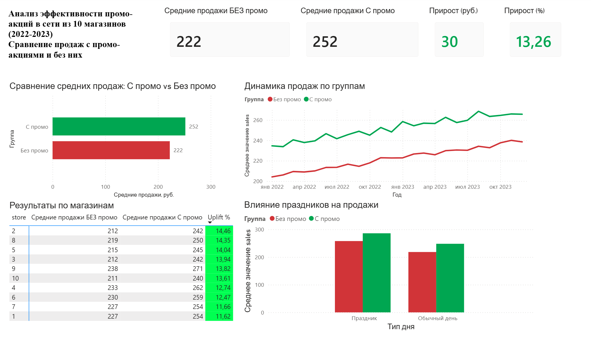

# AB Test Dashboard: Анализ эффективности промо-акций

## Описание проекта

Дашборд Power BI для анализа эффективности промо-акций в сети из 10 магазинов за период 2022-2023. Проект демонстрирует сравнение продаж с промо-акциями и без них.

## Данные

- Источник: [Store Sales Dataset](https://www.kaggle.com/datasets/abhishekjaiswal4896/store-sales-dataset)
- 7300 записей за 2 года
- 10 магазинов
- Поля: `Date`, `Store_ID`, `Sales`, `Promo`, `Holiday`

## Ключевые метрики

- **Средние продажи БЕЗ промо**: 222 руб.
- **Средние продажи С промо**: 252 руб.
- **Прирост**: 30 руб. (+13.26%)

## Визуализации

1. **KPI-карточки** — ключевые показатели эффективности
2. **Столбчатая диаграмма** — сравнение средних продаж по группам
3. **Линейный график** — динамика продаж во времени
4. **Таблица** — детализация результатов по каждому магазину
5. **Анализ праздников** — влияние праздничных дней на продажи

## Технологии

- **Power BI Desktop** — создание дашборда
- **DAX** — вычисляемые меры и столбцы
- **Power Query** — подготовка и трансформация данных

## Структура проекта
store_sales_dash_powerbi/
├── store_sales_dashboard.pbix # Файл Power BI
├── store_sales.csv # Исходные данные
├── dashboard.png # Скриншот дашборда
└── README.md # Описание проекта

## Основные выводы

1. Промо-акции увеличивают средние продажи на **13.26%**
2. Эффект промо **стабилен** во всех 10 магазинах (прирост от 11.66% до 14.06%)
3. Праздничные дни показывают **более высокие продажи** независимо от промо
4. Динамика показывает **устойчивый рост** продаж с промо-акциями

## Превью дашборда

## Как использовать

1. Скачайте файл `ab_test_store_sales_dashboard.pbix`
2. Откройте в Power BI

3. Изучите визуализации и метрики
